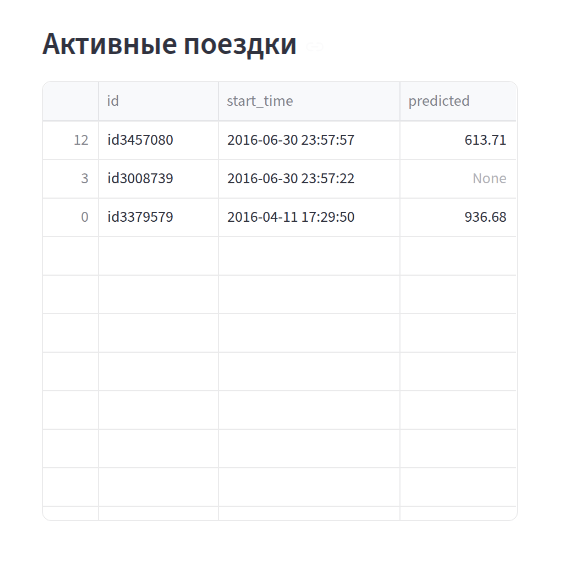
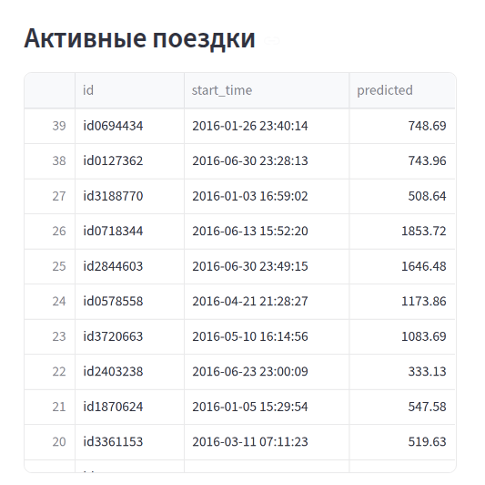
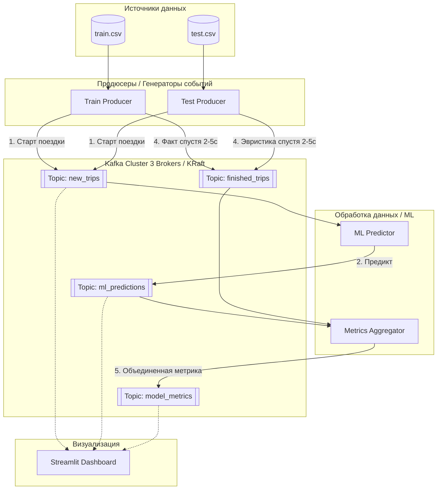

# ML-такси (Kafka-project)


## (Опционально) Подготовка к запуску

Ссылка на данные (соревнование kaggle):
- https://www.kaggle.com/competitions/nyc-taxi-trip-duration/overview

Если хочется запустить блокнот `eda.ipynb`:
1) Сначала нужно собрать образ докера:
```bash
docker build -t taxi-eda-env -f Dockerfile.eda .
```
1) Затем запустить контейнер
```bash
docker run -it --rm \
  -p 8889:8888 \
  -v $(pwd)/data:/app/data \
  -v $(pwd)/models:/app/models \
  --name taxi-eda-container \
  taxi-eda-env
```
1) Подключиться к ноутбуку `eda.ipynb` через:
- `http://localhost:8889` и далее выбор ядра python 3 kernel
1) Нажать Run All, подождать завершения
2) После завершения всех процессов проверить наличие файла `models/taxi_pipeline.pkl`
3) Нажать Ctrl+C, дождаться завершения докера, ввести
```bash
docker container prune
```

## Запуск проекта

Чтобы запустить, нужно ввести
```bash
docker compose up -d --build
```

Чтобы подключиться к интерфейсу Streamlit, просто откройте в браузере:
- `http://localhost:8501`

Для проверки стрессоустойчивости можно ввести:
```bash
docker compose down kafka-2
```
Даже без одного брокера система продолжит работать, а без двух перестанет работать, лучше восстановить упавший, дождаться его поднятия и потом убить другой брокер:
```bash
docker compose up -d kafka-2
sleep 20
docker compose down kafka-1
```

## Схема работы пайплайна

В данной схеме используется:
- 2 продюсера (для `train.csv` и `test.csv`), отправляют сырые данные, потом отправляют актуальные данные оо окончании поездки
- 3 брокера (просто дублируют функции друг друга)
- 3 консьюмера:
    1) ML-регрессор, просто предсказывает для новой записи предположительное время поездки (с погрешностью 30%)
    2) Агрегатор метрик, принимает данные от ML-регрессор и продюсеров, когда те выдадут актуальную инфу по концу поездки
    3) Streamlit-клиент, который содержит дашборд с отслеживание Нью-Йоркского такси и актуальные записи.

Были перебраны разные варианты конфигураций kafka, по итогу лучшим вариантом оказался тот, что ниже:
- `replication_factor` = 2
- `in-sync replicas` = 1

Причина проста: при нём наблюдается единственная адекватная отказоустойчивая система, которая позволяет пережить внезапную пропажу 1 брокера. На втором весь стек ожидаемо ломается, т.к. брокера всего 3, требуется дублировать на 2-х, а второго нет, поэтому стек висит.

Были также рассмотрены следующие варианты:
- Вариант 1, 1:
  - `replication_factor` = 1
  - `in-sync replicas` = 1
  - Проблема: стек падал, данные пропадали (становились `predicted=None` и больше никогда не обновлялись), и их нельзя было восстановить.
  - 

- Вариант 3, 3:
  - `replication_factor` = 3
  - `in-sync replicas` = 3
  - Проблема: стек просто падал. Данные не пропадали, восстанавливась и гнались дальше, но Streamlit моргал и не отвечал.

- Вариант 3, 2:
  - `replication_factor` = 3
  - `in-sync replicas` = 2 (или 1)
  - При падении одного из брокеров ML-воркер переставал делать предикты и список активных поездок просто рос дальше и никак не обрабатывался.
  - После восстановления брокера данные быстро обновлялись.
  - 

### Схема пайплайна

Ниже представлена итоговая схема проекта. Схема рисовалась с помощью стека `mermaid`, так как мне было влом рисовать это через рисовалки.


