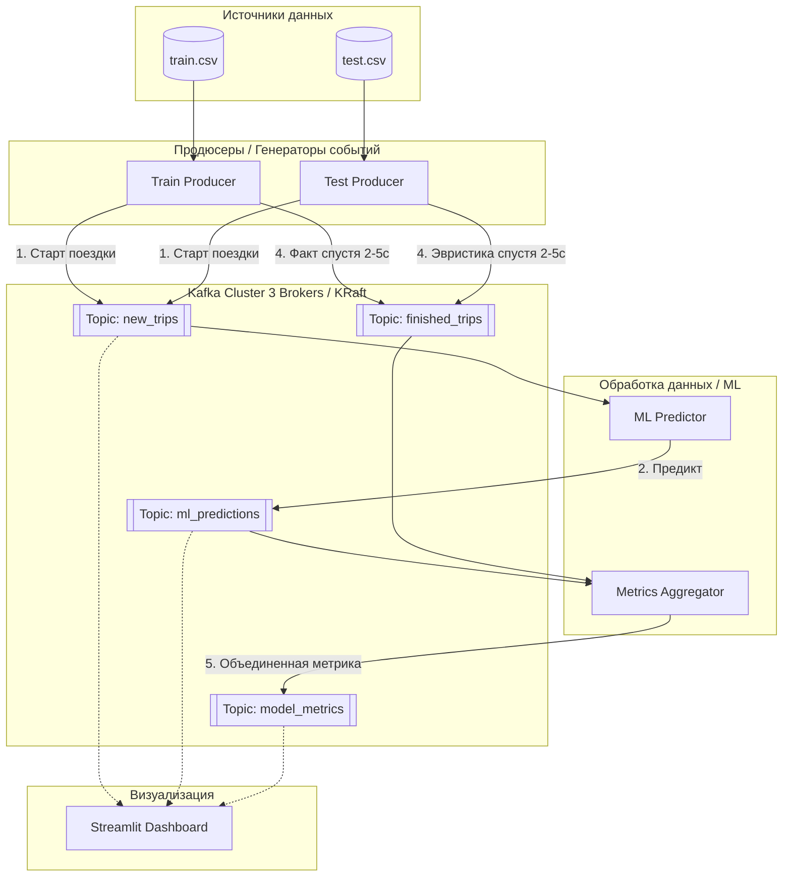

# ML-такси (Kafka-project)


## Подготовка к запуску

Ссылка на данные (соревнование kaggle):
- https://www.kaggle.com/competitions/nyc-taxi-trip-duration/overview

Для работы требуется скачать `train.csv` и `test.csv` и закинуть их в папку `backend/data`.

Также, чтобы получить обученную модель, требуется запустить сверху вниз все ячейки из файла `eda.ipynb`:
1) Сначала нужно собрать образ докера:
```bash
docker build -t taxi-eda-env -f Dockerfile.eda .
```
2) Затем запустить контейнер
```bash
docker run -it --rm \
  -p 8889:8888 \
  -v $(pwd)/backend:/app \
  --name taxi-eda-container \
  taxi-eda-env
```
3) Подключиться к ноутбуку через:
- `http://localhost:8889` и далее выбор ядра python 3 kernel
4) Нажать Run All, подождать завершения
5) После завершения всех процессов проверить наличие файла `backend/models/taxi_pipeline.pkl`
6) Нажать Ctrl+C, дождаться завершения докера, ввести
```bash
docker container prune
```

## Запуск проекта

Чтобы запустить, нужно ввести
```bash
docker compose up -d --build
```

Чтобы подключиться к интерфейсу Streamlit, просто откройте в браузере:
- `http://localhost:8501`

Для проверки стрессоустойчивости можно ввести:
```bash
docker compose down kafka-2
```
Даже без одного брокера система продолжит работать, а без двух перестанет работать, лучше восстановить упавший, дождаться его поднятия и потом убить другой брокер:
```bash
docker compose up -d kafka-2
sleep 20
docker compose down kafka-1
```

## Схема работы пайплайна

В данной схеме используется:
- 2 продюсера (для `train.csv` и `test.csv`), отправляют сырые данные, потом отправляют актуальные данные оо окончании поездки
- 3 брокера (просто дублируют функции друг друга)
- 3 консьюмера:
    1) ML-регрессор, просто предсказывает для новой записи предположительное время поездки (с погрешностью 30%)
    2) Агрегатор метрик, принимает данные от ML-регрессор и продюсеров, когда те выдадут актуальную инфу по концу поездки
    3) Streamlit-клиент, который содержит дашборд с отслеживание Нью-Йоркского такси и актуальные записи.

